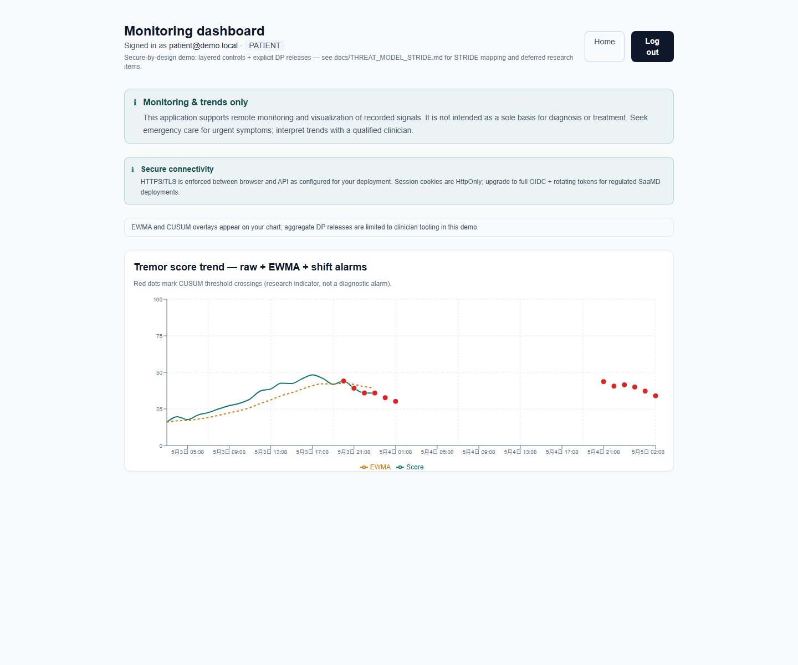
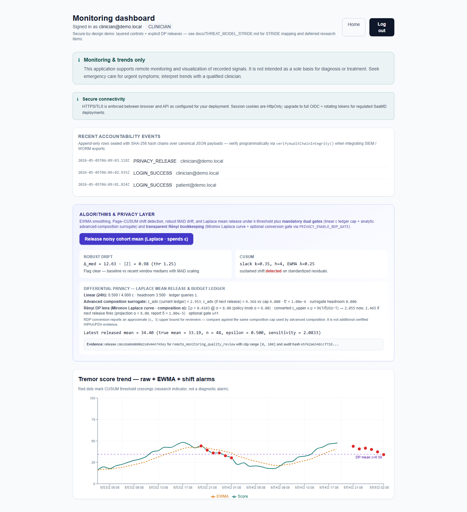
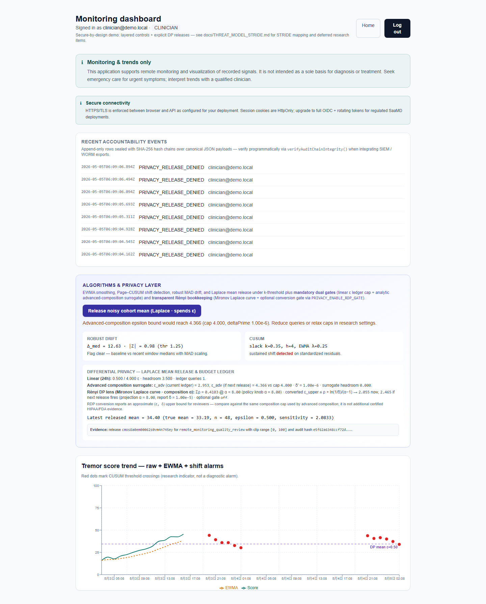

# Privacy Remote Monitor Lab

A small but serious remote patient monitoring lab for one question:

> How can a care team learn from patient telemetry without casually exposing patient data?

This project is not a diagnosis app. It is a privacy-governed analytics demo: patients generate time-series monitoring scores, clinicians can inspect trends, and cohort-level statistics can only be released through differential privacy controls with an audit trail.

## What It Shows

Most health dashboards make the sensitive part too easy: query the data, draw a chart, export a number. This lab slows that down on purpose.

Before a clinician can release a cohort mean, the system checks:

- the cohort is large enough (`k` threshold)
- the value is clipped to a known range
- Laplace noise is added before release
- the daily epsilon budget has room
- an advanced-composition guard still passes
- optional RDP conversion still fits the policy cap
- the release is written into a tamper-evident audit chain

The result is a more realistic privacy story: raw monitoring data may exist in the system, but useful summaries are governed, limited, and accountable.

## Why It Matters

Remote patient monitoring can help clinicians see trends earlier, but it also creates a stream of sensitive behavioral and health-adjacent data. A useful privacy project should do more than hide fields in the UI. It should answer:

- Who is allowed to see individual data?
- Who is allowed to release aggregate data?
- How much privacy budget has already been spent?
- Can a release be denied when policy would be violated?
- Can the team later prove what was released and by whom?

This repository is built around those questions.

## Current Capabilities

- Clinician and patient roles with separate dashboard behavior.
- Time-series monitoring overlays: EWMA, Page-CUSUM, and robust median drift.
- Clinician-only differentially private cohort mean release.
- Privacy ledger with linear epsilon budget, advanced-composition preview, and RDP bookkeeping.
- SHA-256 audit hash chain for login, ingest, and privacy release events.
- Bearer-gated telemetry ingestion with Zod validation and coarse rate limiting.
- STRIDE threat model and contribution-scope notes for honest academic presentation.
- Secure-by-design and compliance-scope notes that separate real controls from certification gaps.
- Unit tests for algorithms, privacy primitives, audit hashing, and compliance hints.
- Playwright smoke tests for health checks and role separation.

## Showcase Screens

Patient view: personal monitoring without cohort release controls.



Clinician view: governed DP release with evidence fields.



Denied release: policy violation is blocked and audited.



## Non-Goals

This project deliberately does not claim:

- medical diagnosis, triage, or treatment recommendations
- HIPAA, GDPR, or FDA certification
- production-grade identity, mTLS, SIEM, WORM storage, or formal DP proofs
- clinically validated thresholds for EWMA, CUSUM, or drift detection

The goal is a credible capstone/research artifact: implemented privacy controls, clear limits, and a path toward a stronger medical data privacy system.

## Tech Stack

| Layer | Choice |
| --- | --- |
| App | Next.js 15, React 19, App Router |
| Language | TypeScript |
| UI | Tailwind CSS, Recharts |
| Data | Prisma 5, SQLite for demo |
| Auth | HttpOnly JWT session cookie, bcrypt demo passwords |
| Validation | Zod |
| Privacy | k threshold, Laplace mechanism, epsilon ledger, advanced composition, RDP bookkeeping |
| Audit | SHA-256 hash chain over canonical audit payloads |
| Tests | Vitest, Playwright |

## Quick Start

```powershell
copy .env.example .env
npm install
npx prisma generate
npx prisma db push
npx prisma db seed
npm run dev
```

Open:

```text
http://localhost:3000
```

Demo accounts use the password from `SHOWCASE_DEMO_PASSWORD` in `.env`. The default is:

```text
showcase
```

| Role | Email | What to Look For |
| --- | --- | --- |
| Clinician | `clinician@demo.local` | audit strip, trend algorithms, DP release controls, budget pressure |
| Patient | `patient@demo.local` | personal monitoring chart without cohort release controls |

## Useful Commands

```powershell
npm run dev
npm run test
npm run build
npm run test:e2e
npm run audit:verify
```

For Playwright locally, build and seed first:

```powershell
npm run build
npx playwright install chromium
npm run test:e2e
```

## API Surface

| Method | Path | Purpose |
| --- | --- | --- |
| `GET` | `/api/health` | Liveness check |
| `GET` | `/api/v1/analytics/private-aggregate` | Clinician-only analytics snapshot without spending epsilon |
| `POST` | `/api/v1/analytics/private-aggregate` | Clinician-only DP cohort mean release |
| `POST` | `/api/v1/observations` | Bearer-gated telemetry ingestion |
| `GET` | `/api/v1/admin/audit-chain` | Bearer-gated audit-chain verification |

## Privacy Knobs

Important `.env` values:

| Variable | Default | Meaning |
| --- | --- | --- |
| `PRIVACY_K_MIN` | `10` | Minimum cohort size before aggregate release |
| `DP_EPSILON_PER_QUERY` | `0.5` | Epsilon spent by one Laplace mean release |
| `PRIVACY_EPSILON_DAILY_CAP` | `4` | Rolling 24-hour linear epsilon cap |
| `PRIVACY_EPSILON_COMPOSITION_CAP` | `4` | Cap for composition guardrails |
| `PRIVACY_COMPOSITION_DELTA_PRIME` | `1e-6` | Slack delta used by the advanced-composition helper |
| `PRIVACY_RDP_ALPHA` | `8` | Renyi order used for RDP bookkeeping |
| `PRIVACY_RDP_REPORT_DELTA` | `1e-5` | Delta used when converting RDP to an epsilon upper bound |
| `PRIVACY_ENABLE_RDP_GATE` | `0` | Set to `1` to enforce the RDP conversion cap |
| `DP_CLIP_MIN` / `DP_CLIP_MAX` | `0` / `100` | Clipping range for mean sensitivity |

## Project Shape

Key files:

- `src/lib/privacy/private-release.ts` - DP release workflow and policy gates
- `src/lib/privacy/budget.ts` - privacy accounting snapshot
- `src/lib/audit.ts` - tamper-evident audit writes and verification
- `src/app/dashboard/page.tsx` - role-aware monitoring dashboard
- `src/app/api/v1/analytics/private-aggregate/route.ts` - analytics and DP release API
- `docs/SECURE_BY_DESIGN.md` - secure-by-design control evidence
- `docs/COMPLIANCE_SCOPE.md` - compliance boundary and regulatory mapping
- `docs/THREAT_MODEL_STRIDE.md` - STRIDE threat model
- `docs/CONTRIBUTION.md` - contribution claims and proof boundary

## Roadmap Toward a Stronger Work

The next improvements should make the project feel less like a demo and more like a privacy product:

1. Expand the release evidence UI into a full evidence pack page.
2. Add tests for every denial path: small cohort, exhausted budget, failed composition gate, RDP gate, and wrong role.
3. Add patient/cohort/consent/device models so the data shape better reflects medical privacy workflows.
4. Add an evidence page mapping STRIDE risks to concrete controls, code paths, and tests.
5. Add SBOM and dependency-review workflow evidence for stronger FDA cybersecurity narratives.

## Production Hardening Notes

For a real deployment, replace the demo assumptions:

- Use managed Postgres and Prisma migrations.
- Use OIDC/SAML, MFA, centralized revocation, and stronger session lifecycle controls.
- Move secrets to a proper secret manager.
- Add edge rate limiting, SIEM export, and immutable audit storage.
- Add field-level encryption or KMS-backed envelope encryption for sensitive records.
- Treat compliance helpers as configuration checks, not legal certification.

## Repository

Git remote:

```text
https://github.com/EM0V0/privacy-remote-monitor-lab.git
```
